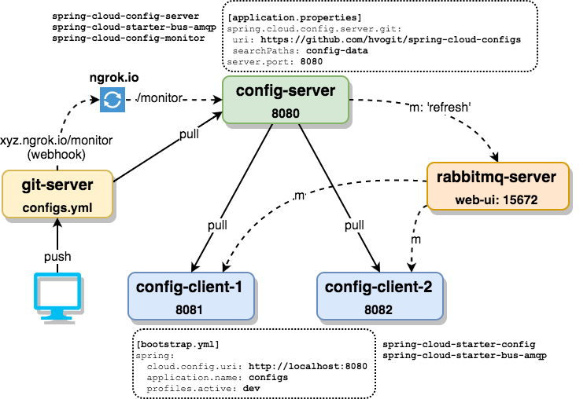

# Spring Cloud Configs Demo



### refs:
* https://cloud.spring.io/spring-cloud-config/
* Building Microservices with Spring Cloud (https://www.youtube.com/watch?v=ZyK5QrKCbwM&t=3888s)
* http://cloud.spring.io/spring-cloud-static/spring-cloud-config/1.3.0.RC1/#_push_notifications_and_spring_cloud_bus
* http://zoltanaltfatter.com/2016/06/30/centralized-configuration-with-spring-cloud-config/
* https://github.com/spring-cloud/spring-cloud-config/blob/master/docs/src/main/asciidoc/quickstart.adoc
* https://github.com/joshlong/bootiful-microservices (https://www.youtube.com/watch?v=cCEvFDhe3os)

### notes:
* `searchPaths`: config-data -> git folder(s) for config files
* `spring.application.name`: configs -> mapped to config file name on git (configs.yml)
* `spring.profiles.active`: dev -> set active profile for client in `bootstrap.yml` or commandline.
* rabbitmq-server web ui: localhost:15672 (guest/guest)
* ngrok.io: http tunneling, exposing local server to public (internet) 
 

### tests:
```js
// http tunnel (web ui: localhost:4040)
ngrok http 8080

// config github webhook to notify config-server when there is a push
// e.g: Payload URL: http://3ad59caf.ngrok.io/monitor -> push events

// or manually notify config-server about configs changes
// curl localhost:8080/monitor -d path="configs"

// run mq server
rabbitmq-server

// run config-server
cd config-server
mvn spring-boot:run 
curl localhost:8080/configs/[|default|dev|test]

// run client #1 with 'dev' profile (configured in bootstrap.yml)
// use -Dspring.profiles.active=xxx for xxx profile)
cd config-client
mvn spring-boot:run -Dserver.port=8081 
curl localhost:8081/[|welcome|hello]

// run client #2
// can use different profile with client #1 to see different config value
cd config-client
mvn spring-boot:run -Dserver.port=8082 
curl localhost:808[1-2]/[|welcome|hello]

// update config value, commit, push.
//   github webhook -> xxx.ngrok.io/monitor -> config-server (local) reloads configs
//   -> notifies rabbitmp-server -> notifies 2 clients 
//   -> eventually, 2 clients pull new configs from the config-server 

// test again, should see the new value in both clients
curl localhost:808[1-2]/[|welcome|hello]

// update readme, commit, push.
// config-server gets refreshed, but not the 2 clients

```

